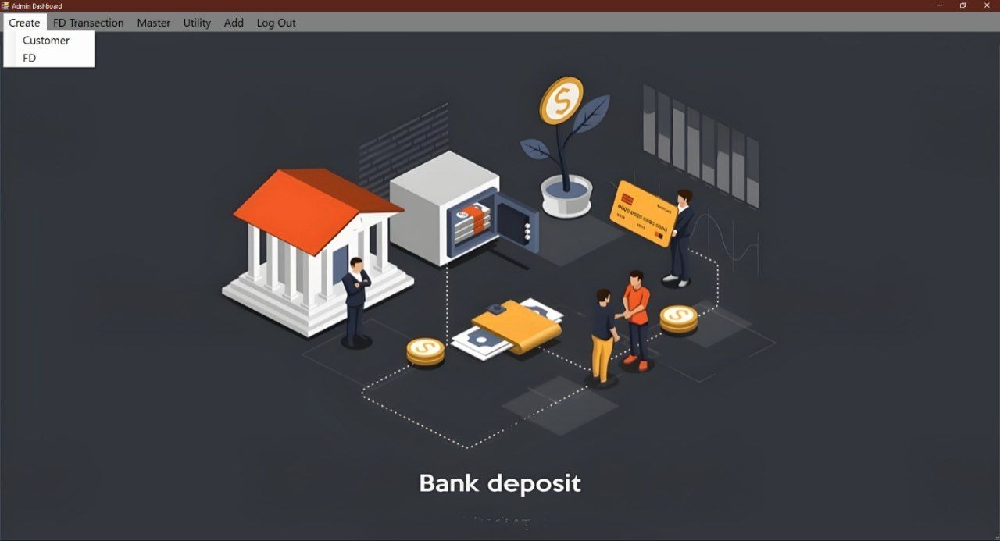

# 🏦 Fixed Deposit Management System

---

This project is your one-stop solution to manage the fixed deposits in a bank. The admin can create any number of employees in the database, and they are added through the Employee section on the dashboard's homepage.

The added employees have the power to create, delete, or modify the customer. Employees can create various types of FDs (Fixed Deposit) as per the customer's need. After creating a FD, the FD Certificate will be generated. Employees are also able to generate various types of reports as per their need.

> [!NOTE]\
> The default username is `administrator` and the password is `administrator`.

## ⚠️ Limitations

As I'm using the Microsoft Access database, it is not encrypted and stored locally, so anyone can see and modify the data directly.

## 📚 Pre-requisite Softwares

1. **Visual Studio 2017**  
Choose the `.Net Core Development` option and install it. Download Visual Studio from [here](https://visualstudio.microsoft.com/vs/older-downloads/)

>[!TIP]
 It is recommended to use the older versions of Visual Studio. You can use 2017 and below versions. You can use the latest version, but the reports may not be generated after versions of 2017. Other functions will work.

1. **SAP Crystal Reports**  
Tool for generating the crystal reports. Download and install from [here](https://foxlearn.com/crystal-reports/how-to-download-and-install-crystal-report-runtime-700.html)

## 🚀 Steps for compiling

1. Download this project and open the project folder in Visual Studio.
2. Update the path in the code:
    * Crystal reports page
    * Access database
3. After updating all the paths, just press `F5` or go to Compile > Build and Run
4. Enjoy! 🥳🎉

## 📸 Screenshots

### 1. Login page: 

### 2. Admin dashboard:

### 3. Create Customer:

### 4. Create FD:

### 5. FD Master:

### 6. FD Reports:

### 7. FD Transection:

### 8. Add Employee:

### 9. Forgot Customer ID:

### 10. Update Interest:

